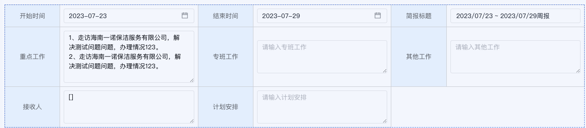
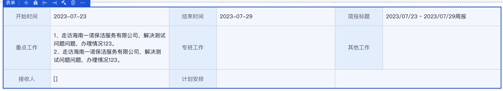
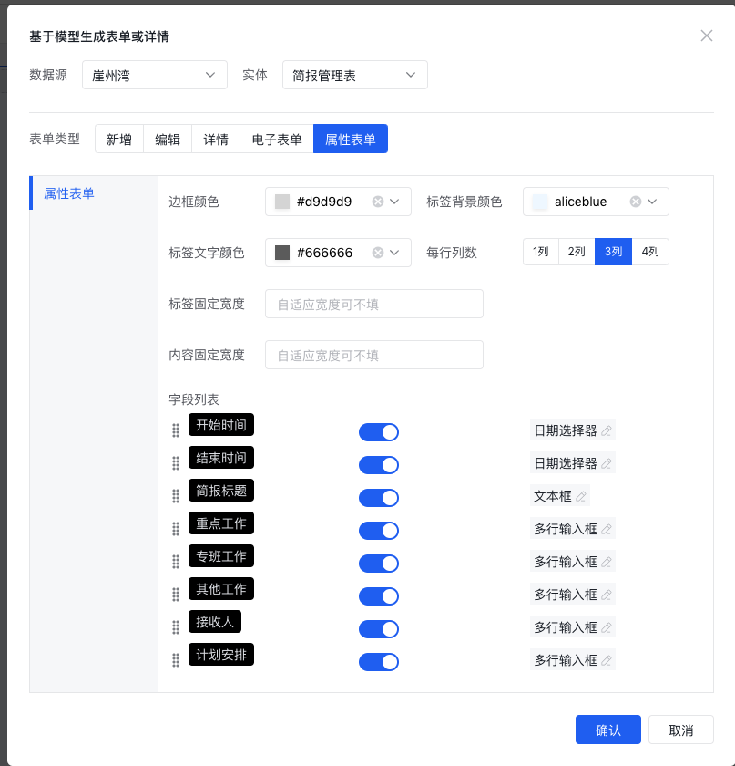

 >   属性表单 property 主要用于form表单表格样式的配置
  
  技术文档 https://aisuda.bce.baidu.com/amis/zh-CN/components/property 
  

``` 
  由于amis本身标签内容宽度自适应 所以可固定宽度

  标签固定宽度 选填 120 标签内容宽度 选填 300
```
   实现效果

  

   静态效果

  

  操作方式

  

 