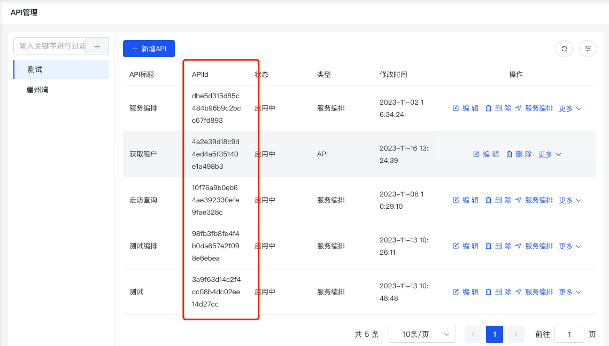
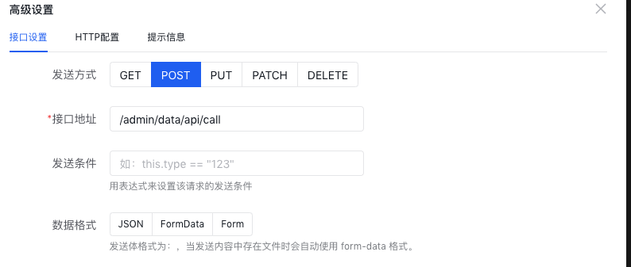
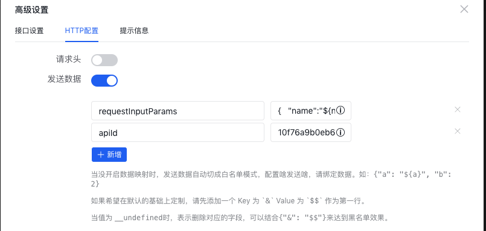

# 概述

>服务编排是FizzGate集成平台提供的一个强大的功能，能够基于现有的业务微服务通过在线配置的方式快速的生成一个聚合接口

## editor服务编排配置
```js
  api(接口)       /admin/data/api/call
  method(请求方式) post
  body(请求参数)  {"apiId":"apiId","requestInputParams":{"name":"${name}"}}
  editor(代码)  
  apiId(下图)
```




## table提交
```js
table服务编排 
/**@requestInputParams 查询参数所属对象
 * @name   查询参数
 * @school 查询参数
 * @apiId  服务编排ID
 */
"source":{
  "url": "/admin/data/api/call",
    "method": "post",
    "data": {
      "apiId": "10f76a9b0eb64ae392330efe9fae328c",
      "requestInputParams": {
        "name":"${name}",
        "school":"${school}",
      }
    }
}
可直接复制到editor上

```


## 表单提交
```js
/**@requestInputParams 查询参数所属对象
 * "&": "$$",   所有查询参数
 * @apiId  服务编排ID
 */
"api":{
  "url": "/admin/data/api/call",
    "method": "post",
    "data": {
      "apiId": "10f76a9b0eb64ae392330efe9fae328c",
      "requestInputParams": {
        "&": "$$",
      }
    }
}
可直接复制到editor上
```